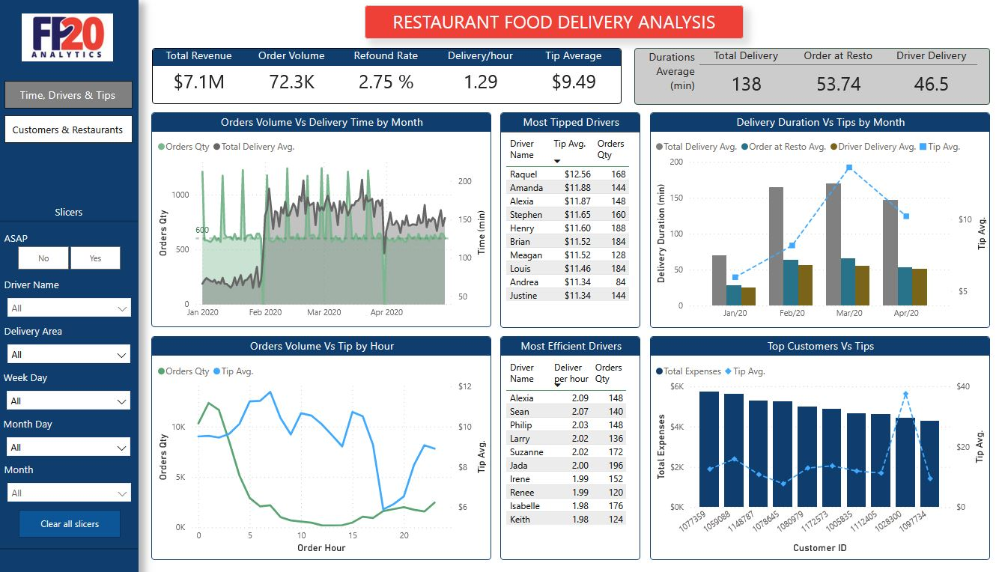
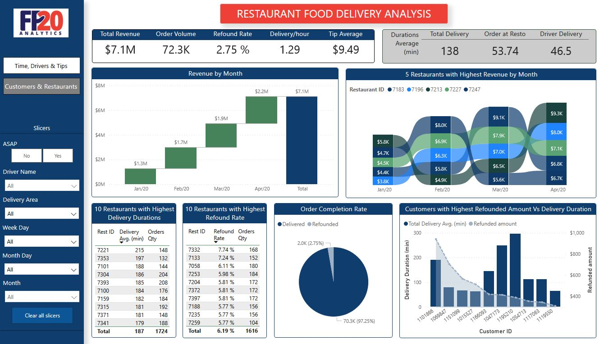

# FP20 6th Analytic Challenge
## Restaurant Food Delivery Analysis

## [The complete interactive report can be found here](https://app.powerbi.com/view?r=eyJrIjoiOTRkZTJjMDYtY2JiNC00MDUyLWJkYjQtYzA4YWY3M2FjMjU5IiwidCI6Ijk5YTVhNjM1LTY1OGEtNGFhMS04MGIxLTdiM2IwNzcxZTkxYiIsImMiOjl9)

The dataset that has been provided contains delivery orders from January 1st to April 31st 2020 from three areas located in San Francisco Bay: Hayward, Fremont and Union City.
The total order amount were 72.314 from 408 different restaurants delivered by 432 different drivers to 6262 different customers.

With that starting point, here are my main conclusions:

The daily number of orders was constant throughout the period with about 600 orders per day with some exceptions: 
- On certain separated days the volume of orders doubled the regular amount (10 days). One possible reason is the participation of Golden State Warriors in NBA games those days  (since delivery areas are located in San Francisco Bay Area).
- On January 31st and March 31st there was only one order each day.
- There were no orders on the 4th, 14th and 24th of January, February and March. One possible reason is a failure in the data system.

From 0am to 5am was the period of the day with highest order quantities and from 11am to 3pm the one with lowest order quantities.

Average delivery time experienced an increase of 135%  from January to February. That level of Avg. delivery time was maintained in March. And in April there was a decrease of 13%.

Despite this, the amount of total revenue grew each month in the period.

