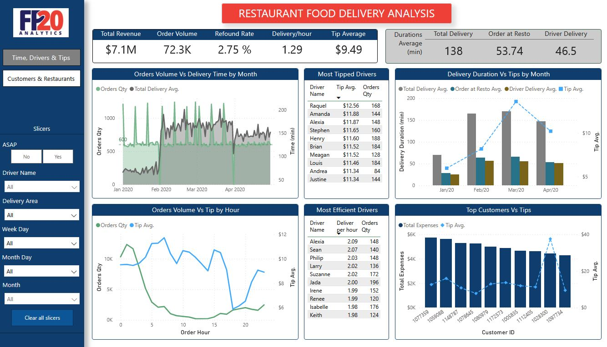
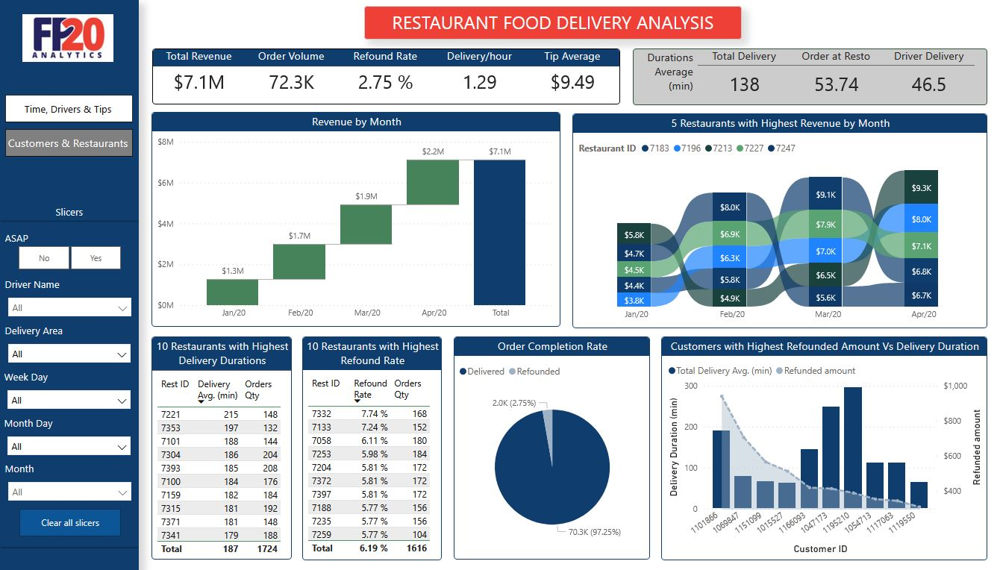

# 🍕 Restaurant Food Delivery Analysis

> Competitive entry for the **FP20 Analytics 6th Challenge** — operational analysis
> of 72,000+ food delivery orders across the San Francisco Bay Area.

---

## 📦 Dataset

| Metric | Value |
|--------|-------|
| Period | Jan – Apr 2020 |
| Areas | Hayward · Fremont · Union City (SF Bay Area) |
| Total Orders | 72,314 |
| Restaurants | 408 |
| Drivers | 432 |
| Customers | 6,262 |

**Source:** Call center restaurant orders CSV provided by FP20 Analytics Challenge.

---

## 🔍 Key Findings

**Order Volume**
- ~600 orders/day consistently throughout the period
- On 10 specific days, order volume **doubled** — likely correlated with Golden State Warriors NBA games in the Bay Area
- No orders recorded on the 4th, 14th and 24th of each month — probable data system failure
- January 31st and March 31st registered only 1 order each

**Time Patterns**
- Peak ordering window: **midnight – 5am**
- Slowest period: **11am – 3pm**

**Delivery Performance**
- Average delivery time spiked **+135%** from January to February
- That elevated level held through March, then dropped **-13%** in April
- Despite longer delivery times, **total revenue grew every month**

---

## 🛠️ Tech Stack

---

## 📁 Repository Files

| File | Description |
|------|-------------|
| `Call Center_Restaurant Orders.csv` | Raw dataset |
| `Intro & Brief_...Challenge 6.pdf` | Official challenge brief |
| `page1.jpg` / `page2.jpg` | Dashboard screenshots |

---

## 📫 Contact

